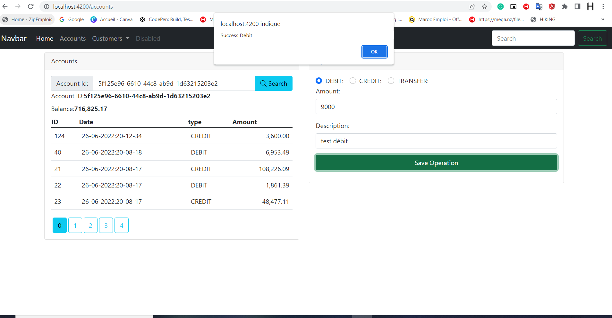
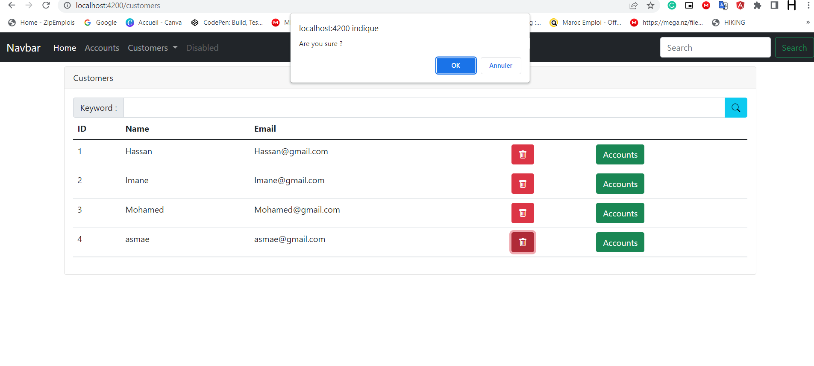

<h2 align="center"  style="color: red" >Compte Rendu</h4>
<h3>Développé une Application de gestion des Comptes des Customers en Utilisant une Architecture
Spring MVC Rendu HTml Coté Client Avec le Framework Angular</h3>

<ul>
  <li style="color: Green"><strong>Tableau des Customers</strong>
  

        <ol> </ol>
        <ol style="text-align: center"><strong style="color: red">Figure 1: </strong> La liste des Customers</ol>
  <li style="color: Green"><strong>Zone de recherche des Customers</strong>
  

        <ol> </ol>
        <ol style="text-align: center"><strong style="color: red">Figure 2: </strong> Recherche des Customers</ol>
  <li style="color: Green"><strong>Ajouter Un nouveau Customer</strong>
  

        <ol> </ol>
        <ol style="text-align: center"><strong style="color: red">Figure 3: </strong> Ajouter un Customer</ol>
  <li style="color: Green"><strong>Rechercher Un compte</strong>
   

    <ol> </ol>
        <ol style="text-align: center"><strong style="color: red">Figure 4: </strong> Rechercher Un compte</ol>
 
</ul>
<h5>Dans cette étape on Recherche Un compte selon Son Id qui sera récupérer de la 
partie Backend</h5>
<ul>
    <ol> </ol>
        <ol style="text-align: center"><strong style="color: red">Figure 5: </strong> Consulter la liste des Operations d'un Compte</ol>
</ul>
<h5>Après la consultation On peut effectuer un ensemble des opérations sur un Compte
</h5>
<ul>
    <ol> </ol>
        <ol style="text-align: center"><strong style="color: red">Figure 6: </strong> Exemple de l'opération DEBIT</ol>
     
   <ol> </ol>
        <ol style="text-align: center"><strong style="color: red">Figure 7: </strong> Exemple de l'opération CREDIT</ol>
    
   <ol> </ol>
<h5>Dans cette étape on effectue un transfer d'un compte vers un autre</h5>
        <ol style="text-align: center"><strong style="color: red">Figure 8: </strong> Exemple de l'opération TRANSFER</ol>
</ul>
<ul>
  
    <ol> </ol>
        <ol style="text-align: center"><strong style="color: red">Figure 9: </strong> Operation de suppression</ol>
</ul>

